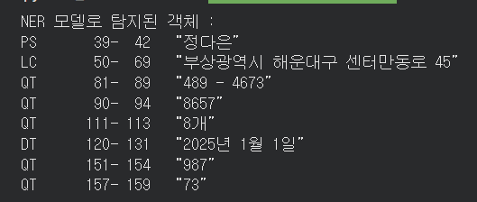
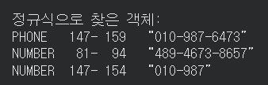
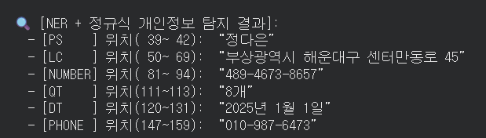

---
layout:
  width: default
  title:
    visible: true
  description:
    visible: false
  tableOfContents:
    visible: true
  outline:
    visible: true
  pagination:
    visible: true
  metadata:
    visible: true
  tags:
    visible: true
  actions:
    visible: true
---

# NER + 정규식 PII 검출

### 3. **NER(KoELECTRA) + 정규표현식(Regex) 개인정보(PII) 탐지**
-  
  1) 한국어 특화 KoELECTRA KLUE‑NER 모델로 텍스트 내 사람(PER), 기관(ORG), 지명(LOC), 날짜(DATE) 같은 의미 있는 객체를 찾습니다.  
  2) 정규식은 전화번호·이메일·주민등록번호처럼 형식이 명확한 PII를 정확하게 추가 검출합니다.
  3) NER과 정규표현식에서 중복으로 탐지된 객체를 제거합니다.

-
  사람 "이름”== NER, “010-1234-5678” == regex가 더 정확하므로 두 방법을 병행하면 서로 보완하여 탐지 성능이 크게 향상됩니다.

#### **NER 모델로 개인정보 탐지 - named entity recognition**
```python
import re
from transformers import AutoTokenizer, AutoModelForTokenClassification, pipeline

# 1) NER 모델 로드 (인명, 기관명, 지명 탐지) - named entity recognition
model_name = "soddokayo/koelectra-base-klue-ner"
tokenizer = AutoTokenizer.from_pretrained(model_name)
ner_model = AutoModelForTokenClassification.from_pretrained(model_name)

ner_pipe = pipeline(
    task="ner",
    model=ner_model,
    tokenizer=tokenizer,
    aggregation_strategy="simple"
)

ner_spans = ner_pipe(full_text)

# NER 결과 정제 (##Subword 토큰 제거)
for ent in ner_spans:
    ent['word'] = ent['word'].replace("##", "").strip()

# 인명(PS) 뒤 조사 제거
def clean_person_particles(spans):
    particles = ["에게", "한테", "께서", "이", "가", "은", "는", "을", "를", "와", "과", "도", "만", "의"]
    particles_sorted = sorted(particles, key=len, reverse=True)

    cleaned = []
    for ent in spans:
        if ent.get("entity_group") == "PS":
            word = ent["word"]
            end = ent["end"]
            for p in particles_sorted:
                if word.endswith(p) and len(word) > len(p):
                    word = word[: -len(p)]
                    end -= len(p)
                    break
            ent = {**ent, "word": word, "end": end}
        cleaned.append(ent)
    return cleaned

ner_spans = clean_person_particles(ner_spans)

print("NER 모델로 탐지된 객체 :")
for ent in ner_spans:
    print(f"{ent['entity_group']:6s} {ent['start']:4d}-{ent['end']:4d}  “{ent['word']}”")
```
<figure><figcaption></figcaption></figure>

#### **정규표현식 패턴 정의 및 탐지 - Regex**
```python
# 2) STT 텍스트 특성에 맞춘 정규표현식 패턴
patterns = [
    (r"01[016789][\s\.-]*\d{3,4}[\s\.-]*\d{4}", "PHONE"),
    (r"\b\d{6}[\s\.-]*[1-4]\d{6}\b", "RRN"),
    (r"[\w\.-]+@[\w\.-]+\.\w+", "EMAIL"),
    (r"\b\d{2,6}(?:[\s\.-]\d{2,6}){1,4}\b", "NUMBER"),
]

regex_spans = []
for pattern, label in patterns:
    for match in re.finditer(pattern, full_text):
        regex_spans.append({
            "entity_group": label,
            "word": match.group(),
            "start": match.start(),
            "end": match.end()
        })

print("\n정규식으로 찾은 객체:")
for ent in regex_spans:
    print(f"{ent['entity_group']:6s} {ent['start']:4d}-{ent['end']:4d}  “{ent['word']}”")
```
<figure><figcaption></figcaption></figure>

#### **중복 구간 제거 및 병합 - Merge**
```python
# 3) 구간 중복/포함 관계 해결
def remove_overlapping_spans(spans):
    sorted_spans = sorted(spans, key=lambda x: (x['end'] - x['start']), reverse=True)
    kept_spans = []
    for current in sorted_spans:
        overlap = False
        for accepted in kept_spans:
            if max(current['start'], accepted['start']) < min(current['end'], accepted['end']):
                overlap = True
                break
        if not overlap:
            kept_spans.append(current)
    return sorted(kept_spans, key=lambda x: x['start'])

all_spans = ner_spans + regex_spans
unique_pii_spans = remove_overlapping_spans(all_spans)

print("\n🔍 [NER + 정규식 개인정보 탐지 결과]:")
for pii in unique_pii_spans:
    label = pii.get("entity_group", "UNK")
    print(f"  - [{label:6s}] 위치({pii['start']:3d}~{pii['end']:3d}): “{pii['word']}”")
```

<figure><figcaption></figcaption></figure>
