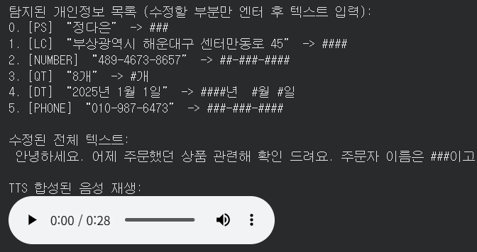

---
layout:
  width: default
  title:
    visible: true
  description:
    visible: false
  tableOfContents:
    visible: true
  outline:
    visible: true
  pagination:
    visible: true
  metadata:
    visible: true
  tags:
    visible: true
  actions:
    visible: true
---

# TTS(Text-to-Speech) - gTTS

### **6. TTS(Text-To-Speech) 합성**

* PII을 수동으로 치환한 후, 한국어 TTS로 다시 음성 합성합니다.
* (음성 -> 텍스트)로 전환 후 개인정보를 찾았기 때문에 (텍스트 -> 음성) 다시 전환해 주는 작업입니다.

```python
!pip install -q gTTS
```

```python
from gtts import gTTS
from IPython.display import Audio, display
from io import BytesIO

# 탐지된 PII 목록 출력 및 수정 입력 받기
print("탐지된 개인정보 목록 (수정할 부분만 엔터 후 텍스트 입력):")
replacements = {}
for i, (word, label, start, end) in enumerate(unique_pii_spans):
    new = input(f"{i}. [{label}] “{word}” -> ")
    if new.strip():
        replacements[word] = new.strip()

# 전체 텍스트에 치환 적용
result = full_text
for orig, new in replacements.items():
    result = result.replace(orig, new)

print("\n수정된 전체 텍스트:")
print(result)

# gTTS로 합성하여 메모리에서 바로 재생
tts = gTTS(result, lang='ko')
buf = BytesIO()
tts.write_to_fp(buf)
buf.seek(0)

print("\nTTS 합성된 음성 재생:")
display(Audio(data=buf.read(), rate=24000))
```

<figure><figcaption></figcaption></figure>
