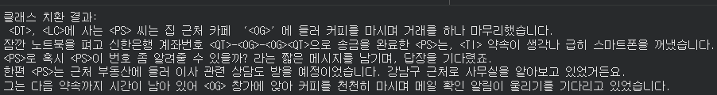

# 클래스 치환 기능

### **5. 클래스 치환 기능 및 적용**

* 탐지된 PII 구간을 살제 값 대신 `<LABEL>` 형태로 치환합니다.
* 어떤 유형(PER/PHONE 등)이었는지만 남겨, 후처리나 모델 학습에 유용하게 활용하기 위함입니다.

```python
# 클래스 함수
def anonymize_classify(text, spans):
    for label, start, end, val in sorted(spans, key=lambda x: x[1], reverse=True):
        text = text[:start] + f"<{label}>" + text[end:]
    return text

# 적용
text_classified = anonymize_classify(text, unique_spans)
print("클래스 치환 결과:\n", text_classified)
```

<figure><figcaption></figcaption></figure>
