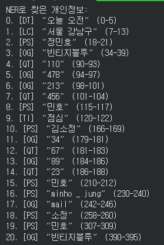
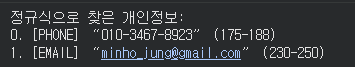
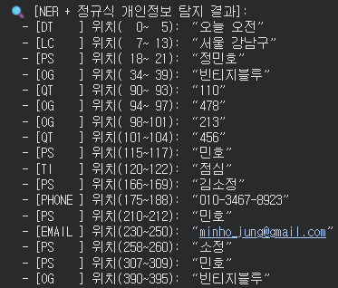

---
layout:
  width: default
  title:
    visible: true
  description:
    visible: false
  tableOfContents:
    visible: true
  outline:
    visible: true
  pagination:
    visible: true
  metadata:
    visible: true
  tags:
    visible: true
  actions:
    visible: true
---

# NER + 정규식 PII 검출

### 2. **NER(KoELECTRA) + 정규표현식(Regex) 개인정보(PII) 탐지**
-  
  1) 한국어 특화 KoELECTRA KLUE‑NER 모델로 텍스트 내 사람(PER), 기관(ORG), 지명(LOC), 날짜(DATE) 같은 의미 있는 객체를 찾습니다.  
  2) 정규식은 전화번호·이메일·주민등록번호처럼 형식이 명확한 PII를 정확하게 추가 검출합니다.
  3) NER과 정규표현식에서 중복으로 탐지된 객체를 제거합니다.

-
  사람 "이름”== NER, “010-1234-5678” == regex가 더 정확하므로 두 방법을 병행하면 서로 보완하여 탐지 성능이 크게 향상됩니다.

#### **2-1 NER 모델로 개인정보 탐지 - named entity recognition**
```python
from transformers import AutoTokenizer, AutoModelForTokenClassification, pipeline

# 1) NER 모델 로드 (인명, 기관명, 지명 탐지) - named entity recognition
model_name = "soddokayo/koelectra-base-klue-ner"
tokenizer = AutoTokenizer.from_pretrained(model_name)
ner_model = AutoModelForTokenClassification.from_pretrained(model_name)

ner_pipe = pipeline(
    task="ner",
    model=ner_model,
    tokenizer=tokenizer,
    aggregation_strategy="simple"
)

origin_ner_spans = ner_pipe(text)

# NER 결과 정제 (##Subword 토큰 제거)
for ent in origin_ner_spans:
    ent['word'] = ent['word'].replace("##", "").strip()

# 인명(PS) 뒤 조사 제거
def clean_person_particles(spans):
    particles = ["에게", "한테", "께서", "이", "가", "은", "는", "을", "를", "와", "과", "도", "만", "의"]
    particles_sorted = sorted(particles, key=len, reverse=True)

    cleaned = []
    for ent in spans:
        if ent.get("entity_group") == "PS":
            word = ent["word"]
            end = ent["end"]
            for p in particles_sorted:
                if word.endswith(p) and len(word) > len(p):
                    word = word[: -len(p)]
                    end -= len(p)
                    break
            ent = {**ent, "word": word, "end": end}
        cleaned.append(ent)
    return cleaned

origin_ner_spans = clean_person_particles(origin_ner_spans)

ner_spans = []
for ent in origin_ner_spans:
  ner_spans.append((ent["entity_group"], ent["start"], ent["end"], ent["word"]))

print("NER로 찾은 개인정보:")
for i,(label,start,end,val) in enumerate(ner_spans):
    print(f"{i}. [{label}] “{val}” ({start}-{end})")
```
<figure><figcaption></figcaption></figure>

#### **2-2 정규표현식 패턴 정의 및 탐지 - Regex**
```python
import re

# 정규식 패턴 정의: (패턴, 라벨)
patterns = [
    (r"\b01[016789]-\d{3,4}-\d{4}\b", "PHONE"),
    (r"[\w\.-]+@[\w\.-]+\.\w+\b", "EMAIL"),
    (r"\b\d{6}-\d{7}\b", "RRN"),
]

# 정규식으로 탐지된 결과 리스트
regex_spans = []

for pattern, label in patterns:
    for match in re.finditer(pattern, text):
        regex_spans.append((
            label,             # 라벨 (PHONE, EMAIL, RRN)
            match.start(),     # 시작 위치
            match.end(),       # 끝 위치
            match.group()      # 탐지된 문자열
        ))

print("정규식으로 찾은 개인정보:")
for i,(label,start,end,val) in enumerate(regex_spans):
    print(f"{i}. [{label}] “{val}” ({start}-{end})")
```
<figure><figcaption></figcaption></figure>

#### **2-3 중복 구간 제거 및 병합 - Merge**
```python
# 3) 구간 중복/포함 관계 해결
def remove_overlapping_spans(spans):
    # 인덱스: 0 = label, 1 = start, 2 = end, 3 = word
    # x[2] - x[1] : (end - start) 길이 기준 내림차순 정렬
    sorted_spans = sorted(
        spans, key=lambda x: (x[2] - x[1]), reverse=True
    )
    kept_spans = []

    for current in sorted_spans:
        overlap = False
        for accepted in kept_spans:
            # current[1], accepted[1] = start
            # current[2], accepted[2] = end
            if max(current[1], accepted[1]) < min(current[2], accepted[2]):
                overlap = True
                break
        if not overlap:
            kept_spans.append(current)

    # 시작 위치(start = x[1]) 기준으로 정렬
    return sorted(kept_spans, key=lambda x: x[1])

all_spans = ner_spans + regex_spans
unique_pii_spans = remove_overlapping_spans(all_spans)

# 4) 튜플 언패킹 방식으로 출력
print("\n🔍 [NER + 정규식 개인정보 탐지 결과]:")
for label, start, end, val in unique_pii_spans:
    print(f"  - [{label:6s}] 위치({start:3d}~{end:3d}): “{val}”")
```

<figure><figcaption></figcaption></figure>
