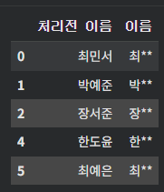

---
layout:
  width: default
  title:
    visible: true
  description:
    visible: false
  tableOfContents:
    visible: true
  outline:
    visible: true
  pagination:
    visible: true
  metadata:
    visible: true
  tags:
    visible: true
  actions:
    visible: true
---

# 마스킹

### 1. 마스킹 처리  - masking

원본 형식이 유지되어 데이터 형태 파악이 쉽게 일부 문자만 남기고 나머지를 \*또는 O로 대체합니다.&#x20;

```python
# ── 이름: 마스킹 방식 ──
def mask_name(name):
    if len(name) <= 1:
        return name
    return name[0] + '*' * (len(name) - 1)

process_df['이름'] = process_df['이름'].apply(mask_name)

# 마스킹 전/후를 담은 결과 데이터프레임 생성
result = pd.DataFrame({
    '처리전 이름': clean_df['이름'],
    '이름': clean_df['이름'].apply(mask_name)
})

result.head(5)
```

\[출력 결과]

<figure><figcaption></figcaption></figure>
